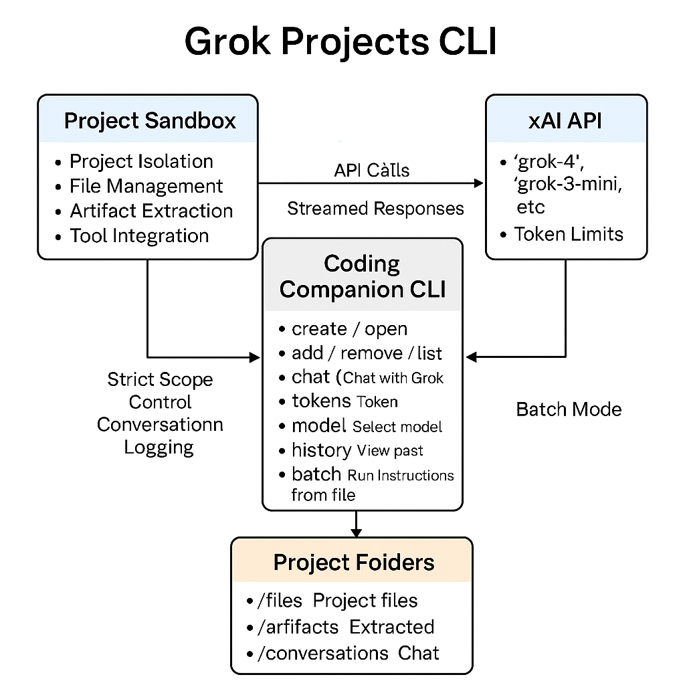

Grok Projects CLI – Website-Parity Coding Companion (Enhanced)
A fully featured command-line interface for managing isolated coding projects and interacting with xAI’s Grok models.
Designed to give you website-level capabilities in your terminal — project isolation, artifact management, batch automation, and rich chat with context-aware code analysis.

✨ Features
Project Isolation – Each project has its own sandbox; Grok only sees files in the current project.

Strict Scope Control – No accidental filesystem exposure outside /files folder.

File Management – Add, remove, list, and sync files per project.

Context-Aware Chat – Include all files, selected files, or no files in Grok prompts.

Automatic Artifact Extraction – Large code blocks from responses are saved to /artifacts with versioned filenames.

Model Management – Switch between grok-4, grok-3, and grok-3-mini (or use custom IDs).

Token Estimation – Uses tiktoken when available, with safe fallbacks.

Conversation Logging – All chats saved as JSON; consolidated history in project_history.json.

Batch Mode – Run a series of CLI commands from a .txt file.

Robust Streaming – Falls back to non-streaming mode automatically if needed.

Tool Integration – Built-in hooks for adding real-time utilities (e.g., date/time, web search).

🚀 Quickstart
1. Install Requirements
bash
Copy
Edit
pip install --upgrade openai python-dotenv tiktoken requests beautifulsoup4
2. Set Your API Key
bash
Copy
Edit
export XAI_API_KEY="xai-..."
3. Run the CLI
bash
Copy
Edit
python GrokProjects_v3.py
📦 Basic Commands
Command	Description
create <name>	Create a new project
open <name>	Open an existing project
projects	List all projects
add <filepath>	Add a file to the current project
files	List files in the current project
remove <filename>	Remove a file from the current project
update	Sync metadata with files on disk
view <filename>	View a file's contents
tokens	Show token estimates for project files
models	List available models
model <alias or id>	Switch the active model
chat <message>	Chat with Grok (full context)
chat -n <message>	Chat with no file context
chat -s file1,file2 -- msg	Chat including only specific files
chat -f <filename>	Use file contents as your message

📜 Batch Mode Example
Save your commands to instructions.txt:

text
Copy
Edit
# Create and open a project
create my_project
open my_project

# Add files
add ./script.py

# Ask Grok for analysis
chat "Analyze this code and suggest improvements"
Run:

bash
Copy
Edit
python GrokProjects_v3.py instructions.txt
🗂 Project Structure
bash
Copy
Edit
Grok_Projects/
  my_project/
    files/           # Your source files
    artifacts/       # Extracted code artifacts
    conversations/   # JSON logs of all interactions
    metadata.json    # Project metadata
⚙️ Token & Context Limits
Grok-4: 200K input tokens (256K total input + output).

Overhead of ~2,000 tokens reserved for system instructions.

Use tokens command to track file context usage.

🛡 Hardening & Safety
Automatic retry if streaming fails.

API key validation on startup.

No ambient filesystem access outside the current project.

Full conversation and file history for auditability.

